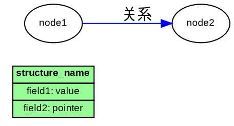

# Graphviz Visualizer Skill

一个专业的 Claude Code 技能，用于创建符合标准规范的 Graphviz DOT 数据结构可视化图表。

## 技能概述

这个技能使 Claude Code 成为创建高质量数据结构可视化图表的专家，特别适用于：
- Linux 内核数据结构
- 网络协议栈
- 哈希表、链表等复杂数据结构
- NAT、连接跟踪等系统级组件

## 安装方法

### 方法 1: 手动安装（推荐）

1. **复制整个 skill 目录**到 Claude Code 的 skills 目录：
   ```bash
   # Windows
   cp -r graphviz-visualizer %USERPROFILE%\.claude\skills\

   # macOS/Linux
   cp -r graphviz-visualizer ~/.claude/skills/
   ```

2. **重启 Claude Code** 或重新加载配置

3. **验证安装**：
   ```bash
   # 在 Claude Code 中询问
   "请使用 graphviz-visualizer skill 为我创建一个哈希表的可视化"
   ```

### 方法 2: 使用 Skill Seekers 工具

如果你使用 [Skill_Seekers](https://github.com/yusufkaraaslan/Skill_Seekers) 工具：

```bash
# 假设你已经有这个 skill 目录
cd graphviz-visualizer
python3 package_skill.py .
# 生成的 ZIP 文件可以导入到 Claude Code
```

## 目录结构

```
graphviz-visualizer/
├── SKILL.md                          # 核心技能定义（自动加载）
├── README.md                         # 本说明文档
├── references/                       # 参考文档（按需加载）
│   ├── style_guide.md               # 完整样式指南
│   ├── color_scheme.md              # 颜色方案详解
│   └── examples.md                  # 常见结构示例
└── assets/                          # 资源文件
    └── templates/                   # 可复用模板
        ├── basic_template.dot       # 基础结构模板
        ├── hash_table_template.dot  # 哈希表模板
        └── dual_hash_template.dot   # 双哈希表模板
```

## 使用方式

### 自动激活

当你向 Claude Code 提出以下类型的请求时，此技能会自动激活：

1. **直接可视化请求**
   ```
   "为这个哈希表结构创建 Graphviz 图表"
   "可视化 NAT servermap 的数据结构"
   "生成双向链表的 DOT 代码"
   ```

2. **提供结构体定义**
   ```
   "这是我的结构体定义，请帮我可视化：
   struct hash_node {
       char *key;
       int value;
       struct hash_node *next;
   };"
   ```

3. **改进现有图表**
   ```
   "这是我现有的 DOT 代码，请按照标准规范改进它"
   ```

### 手动调用

如果需要显式使用此技能：
```
"请使用 graphviz-visualizer skill 帮我..."
```

## 核心特性

### 1. 标准化的 HTML Table 节点格式
- 所有节点使用 HTML `<TABLE>` 标签
- 字段垂直排列，清晰易读
- 标题行自动加粗
- 关键字段自动添加 PORT 锚点

### 2. 统一的颜色方案
| 节点类型 | 颜色 | 使用场景 |
|---------|------|---------|
| 全局指针 | `lightyellow` | 入口节点、根指针 |
| Internal | `lightblue` | 内部/源侧结构 |
| External | `lightcoral` | 外部/目标侧结构 |
| 主节点 | `palegreen` | 核心数据结构 |
| 辅助结构 | `wheat` | Timer、Tuple 等 |
| 说明 | `lightgray` | 注释和说明框 |

### 3. 智能连接线样式
- 普通指针：黑色实线
- 哈希链接：蓝色/红色粗线（根据方向）
- 链表连接：绿色实线
- 包含关系：虚线
- 说明引用：点线

### 4. 特殊结构支持
- 水平哈希桶数组
- 双哈希表索引
- 双向链表
- 说明框和注释

## 输出示例

生成的 DOT 代码格式：



## 渲染图表

使用 Graphviz 工具渲染生成的 DOT 代码：

```bash
# 生成 SVG（推荐，可缩放）
dot -Tsvg diagram.dot -o diagram.svg

# 生成 PNG
dot -Tpng diagram.dot -o diagram.png

# 生成 PDF
dot -Tpdf diagram.dot -o diagram.pdf
```

### 在线渲染工具

如果没有安装 Graphviz：
- [Graphviz Online](https://dreampuf.github.io/GraphvizOnline/)
- [WebGraphviz](http://www.webgraphviz.com/)
- [Edotor](https://edotor.net/)

## 实际应用场景

### 场景 1: 可视化内核数据结构
```
用户: "请可视化 Linux 内核的 sk_buff 结构"
Claude: [自动使用此技能生成标准格式的图表]
```

### 场景 2: 理解哈希表实现
```
用户: "我有一个哈希表实现，帮我画出它的结构"
Claude: [生成包含桶数组、链表节点的完整图表]
```

### 场景 3: 文档化系统设计
```
用户: "为我的 NAT 系统生成架构图"
Claude: [生成双哈希表结构图，清晰展示内外部索引]
```

### 场景 4: 优化现有图表
```
用户: "这是我之前画的图，但不够清晰，帮我改进"
Claude: [应用标准规范重构图表，提升可读性]
```

## 技能优势

### ✅ 开箱即用
- 无需记忆复杂的 Graphviz 语法
- 自动应用最佳实践
- 统一的视觉风格

### ✅ 高质量输出
- 符合专业标准
- 清晰的层次结构
- 一致的颜色语义

### ✅ 灵活适配
- 支持多种数据结构
- 可定制化程度高
- 包含丰富的模板

### ✅ 文档齐全
- 完整的样式指南
- 常见示例库
- 可复用模板

## 参考资源

### 内部文档
- [`references/style_guide.md`](references/style_guide.md) - 450+ 行完整规范
- [`references/color_scheme.md`](references/color_scheme.md) - 颜色使用详解
- [`references/examples.md`](references/examples.md) - 9 种常见结构示例

### 模板文件
- [`assets/templates/basic_template.dot`](assets/templates/basic_template.dot)
- [`assets/templates/hash_table_template.dot`](assets/templates/hash_table_template.dot)
- [`assets/templates/dual_hash_template.dot`](assets/templates/dual_hash_template.dot)

### 外部资源
- [Graphviz 官方文档](https://graphviz.org/documentation/)
- [DOT 语言参考](https://graphviz.org/doc/info/lang.html)
- [HTML-like Labels](https://graphviz.org/doc/info/shapes.html#html)

## 常见问题

### Q: 如何验证技能是否安装成功？
A: 在 Claude Code 中询问："你有 graphviz-visualizer 技能吗？" 或直接请求可视化任务。

### Q: 可以修改颜色方案吗？
A: 可以！编辑 `references/color_scheme.md` 和 `SKILL.md` 中的颜色定义即可。

### Q: 生成的图表太大怎么办？
A: Claude 会自动优化布局，或者你可以要求："请简化图表，只展示核心部分"。

### Q: 支持哪些 Graphviz 布局引擎？
A: 默认使用 `dot` 引擎（层次布局），技能会根据数据结构类型自动设置 `rankdir=LR` 或 `rankdir=TB`。

### Q: 如何添加自定义模板？
A: 将新模板 `.dot` 文件放入 `assets/templates/` 目录，然后在请求中引用。

## 版本信息

- **版本**: v1.0
- **创建日期**: 2025-11-10
- **适用 Claude Code 版本**: 所有版本
- **依赖**: 无（纯 Markdown 技能）

## 更新日志

### v1.0 (2025-11-10)
- ✨ 初始版本
- ✅ 完整的样式指南（450+ 行）
- ✅ 标准颜色方案
- ✅ 9 种常见结构示例
- ✅ 3 个可复用模板
- ✅ 自动激活机制

## 贡献与反馈

如果你有改进建议或发现问题：
1. 直接修改 `SKILL.md` 或参考文档
2. 添加新的示例到 `references/examples.md`
3. 贡献新的模板到 `assets/templates/`

## 许可证

本技能基于原始 Graphviz 规范文档创建，遵循相同的开源协议。

---

**准备好了吗？** 现在就让 Claude Code 使用这个技能为你创建专业的数据结构可视化图表！

```
"请帮我可视化一个哈希表，包含链表冲突解决"
```
