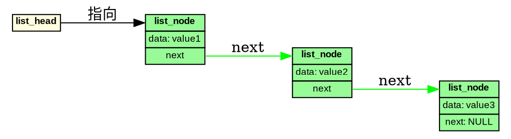
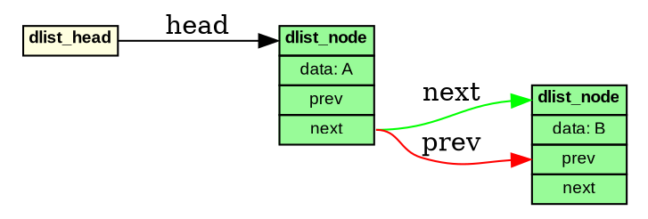
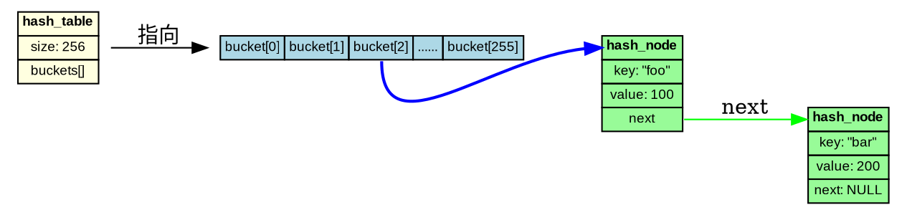
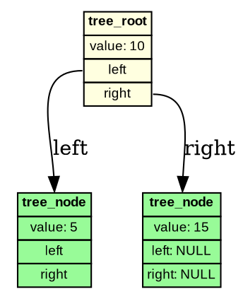
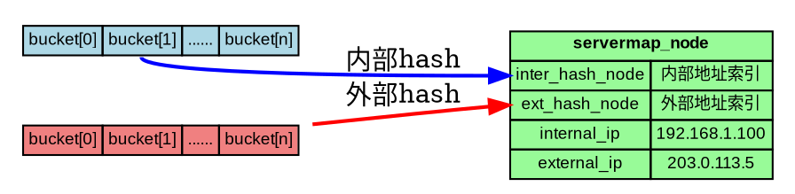
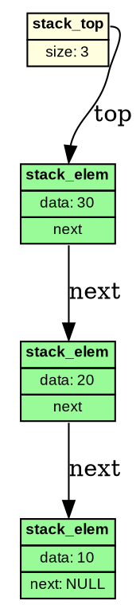
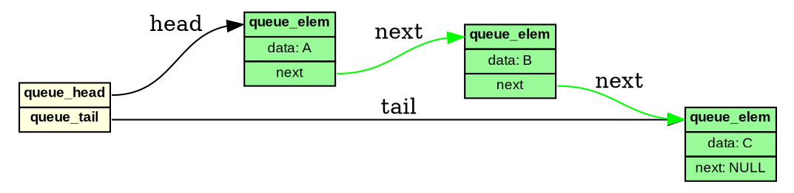
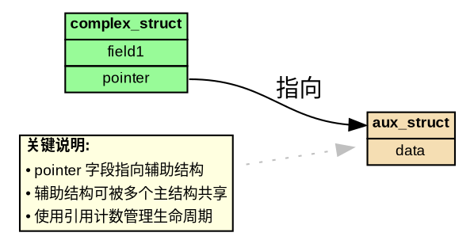

# Graphviz 数据结构可视化 - 常见示例

本文档提供常见数据结构的标准 Graphviz 实现模板。

---

## 1. 简单链表



---

## 2. 双向链表



---

## 3. 哈希表（拉链法）



---

## 4. 二叉树



---

## 5. 双哈希表结构（NAT Servermap 风格）



---

## 6. 栈结构



---

## 7. 队列结构



---

## 8. 图结构（邻接表）

```dot
digraph Graph {
    rankdir=LR;
    node [fontname="Arial", fontsize=9];

    // 顶点数组
    vertices [label=<
        <TABLE BORDER="0" CELLBORDER="1" CELLSPACING="0" BGCOLOR="lightyellow">
            <TR>
                <TD PORT="v0">Vertex A</TD>
                <TD PORT="v1">Vertex B</TD>
                <TD PORT="v2">Vertex C</TD>
            </TR>
        </TABLE>
    >, shape=plaintext];

    // A 的邻接表
    edge_a1 [label=<
        <TABLE BORDER="0" CELLBORDER="1" CELLSPACING="0" BGCOLOR="palegreen">
            <TR><TD PORT="top"><B>edge</B></TD></TR>
            <TR><TD>to: B</TD></TR>
            <TR><TD>weight: 5</TD></TR>
            <TR><TD PORT="next">next</TD></TR>
        </TABLE>
    >, shape=plaintext];

    edge_a2 [label=<
        <TABLE BORDER="0" CELLBORDER="1" CELLSPACING="0" BGCOLOR="palegreen">
            <TR><TD PORT="top"><B>edge</B></TD></TR>
            <TR><TD>to: C</TD></TR>
            <TR><TD>weight: 3</TD></TR>
            <TR><TD PORT="next">next: NULL</TD></TR>
        </TABLE>
    >, shape=plaintext];

    // 连接
    vertices:v0 -> edge_a1:top [label="edges"];
    edge_a1:next -> edge_a2:top [label="next", color=green];
}
```

---

## 9. 带说明框的复杂结构



---

## 使用建议

1. **选择合适模板**: 根据数据结构类型选择最接近的模板
2. **修改字段内容**: 替换示例数据为实际字段
3. **调整颜色**: 根据语义选择合适的背景色
4. **添加 PORT**: 为需要连接的字段添加端口
5. **测试渲染**: 使用 `dot -Tsvg` 测试输出

## 渲染命令

```bash
# 保存代码为 example.dot，然后执行：
dot -Tsvg example.dot -o example.svg
```
