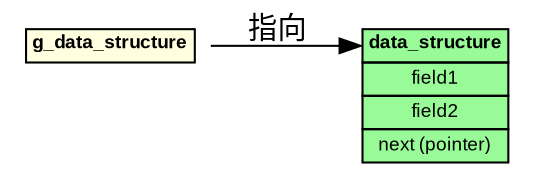
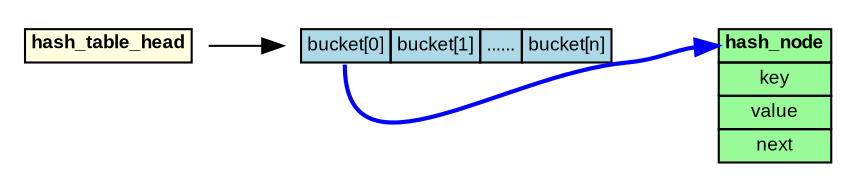
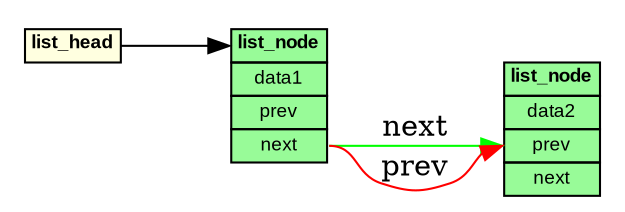

# Graphviz DOT 数据结构可视化通用规则文档

## 文档版本
**版本**: v1.0
**创建日期**: 2025-11-10
**适用范围**: 所有内核数据结构、网络协议栈、哈希表等复杂数据结构的可视化

---

## 一、设计原则

### 1.1 统一风格标准
- **布局方向**: `rankdir=LR` (从左到右，符合数据流向)
- **节点格式**: 使用 HTML `<TABLE>` 标签，字段垂直排列
- **字体设置**: `fontname="Arial", fontsize=9`
- **形状类型**: `shape=plaintext` (配合HTML table使用)

### 1.2 视觉层次
1. **全局指针/根节点**: 浅黄色 (`lightyellow`)
2. **主数据结构**: 根据类型使用不同颜色
   - Internal/源侧: 浅蓝色 (`lightblue`)
   - External/目标侧: 浅珊瑚色 (`lightcoral`)
   - 节点/实体: 浅绿色 (`palegreen`)
   - 辅助结构: 小麦色 (`wheat`)
   - 说明/元数据: 浅灰色 (`lightgray`)
3. **连接线**: 使用颜色和线宽区分关系类型

---

## 二、HTML Table 节点语法规范

### 2.1 基本模板

```dot
node_name [label=<
    <TABLE BORDER="0" CELLBORDER="1" CELLSPACING="0" BGCOLOR="color">
        <TR><TD PORT="portname" COLSPAN="1"><B>结构体名称</B></TD></TR>
        <TR><TD>字段1</TD></TR>
        <TR><TD>字段2</TD></TR>
        <TR><TD PORT="field3">字段3</TD></TR>
        <TR><TD>字段4</TD></TR>
    </TABLE>
>, shape=plaintext];
```

### 2.2 关键参数说明

| 参数 | 值 | 说明 |
|------|-----|------|
| `BORDER` | "0" | 外边框宽度 (通常为0) |
| `CELLBORDER` | "1" | 单元格边框宽度 |
| `CELLSPACING` | "0" | 单元格间距 |
| `BGCOLOR` | 颜色名 | 背景色 |
| `PORT` | 端口名 | 用于精确连接的锚点 |
| `COLSPAN` | 数字 | 单元格跨列数 |
| `ALIGN` | LEFT/CENTER/RIGHT | 文本对齐方式 |

### 2.3 标题行规范

```dot
<TR><TD PORT="top" COLSPAN="1"><B>结构体名称</B></TD></TR>
```

- 使用 `<B>` 标签加粗
- 添加 PORT="top" 用于顶部连接
- 背景色在 TABLE 标签中统一设置

### 2.4 端口 (PORT) 使用规则

端口用于精确指定连接线的起点和终点：

```dot
<TR><TD PORT="field_name">字段内容</TD></TR>
```

连接时使用:
```dot
node1:field_name -> node2:other_field [label="关系"];
```

**命名建议**:
- 顶部标题: `PORT="top"`
- 列表头: `PORT="head"`
- 具体字段: 使用字段名缩写，如 `PORT="ext_hash"`, `PORT="inter_hash"`

---

## 三、标准颜色方案

### 3.1 预定义颜色表

| 用途 | 颜色名 | 16进制 | 适用场景 |
|------|--------|--------|----------|
| 全局指针/入口 | `lightyellow` | #FFFFE0 | 全局变量、哈希表头指针 |
| Internal/源侧 | `lightblue` | #ADD8E6 | 内部地址、源地址相关 |
| External/目标侧 | `lightcoral` | #F08080 | 外部地址、目标地址相关 |
| 主节点 | `palegreen` | #98FB98 | 核心数据节点 |
| 辅助结构 | `wheat` | #F5DEB3 | Tuple、Timer等辅助 |
| 说明/元数据 | `lightgray` | #D3D3D3 | 结构说明、示例 |
| 注释/说明框 | `lightyellow` | #FFFFE0 | 文字说明框 |

### 3.2 颜色使用原则

1. **一致性**: 同类结构使用相同颜色
2. **对比性**: 相关但不同的结构使用对比色（如 lightblue vs lightcoral）
3. **可读性**: 避免使用深色背景，确保黑色文字清晰可读

---

## 四、连接线规范

### 4.1 线条样式

| 关系类型 | 样式 | 颜色 | 线宽 | 示例 |
|----------|------|------|------|------|
| 指针指向 | solid | black | 1 | `->` |
| 哈希链接 | solid | blue/red | 2 | `-> [color=blue, penwidth=2]` |
| 链表连接 | solid | green | 1-2 | `-> [color=green]` |
| 包含关系 | dashed | black | 1 | `-> [style=dashed]` |
| 说明引用 | dotted | gray | 1 | `-> [style=dotted]` |

### 4.2 连接线标签

```dot
node1 -> node2 [label="关系说明", color=blue, penwidth=2, style=solid];
```

**标签建议**:
- 指针: "指向"
- 哈希: "hash链"
- 链表: "next", "prev"
- 数组: "数组元素[索引]"
- 包含: "包含", "has-a"

### 4.3 使用端口的连接

```dot
// 从 node1 的 field1 端口连接到 node2 的 field2 端口
node1:field1 -> node2:field2 [label="连接说明"];

// 从节点整体连接到特定端口
node1 -> node2:top;

// 从特定端口连接到节点整体
node1:bottom -> node2;
```

---

## 五、特殊结构处理

### 5.1 哈希表数组 (水平布局)

```dot
hash_array [label=<
    <TABLE BORDER="0" CELLBORDER="1" CELLSPACING="0" BGCOLOR="lightblue">
        <TR>
            <TD PORT="h0">bucket[0]</TD>
            <TD PORT="h1">bucket[1]</TD>
            <TD PORT="h2">bucket[2]</TD>
            <TD>......</TD>
            <TD PORT="hn">bucket[n]</TD>
        </TR>
    </TABLE>
>, shape=plaintext];
```

**特点**:
- 单行多列 (`<TR>` 只有一个)
- 每列一个 PORT，便于连接到不同的链表
- 使用省略号表示省略的桶

### 5.2 链表结构

垂直排列的节点，使用 `next`/`prev` 连接:

```dot
node1 -> node2 [label="next", color=green];
node2 -> node3 [label="next", color=green];
node3 -> more [label="next", style=dashed];  // 省略部分用虚线

more [label="......", shape=plaintext];  // 占位符
```

### 5.3 双向索引 (如双哈希表)

同一节点连接到两个哈希表:

```dot
// Internal hash 连接
inter_hash -> node:inter_hash [color=blue, penwidth=2];

// External hash 连接
ext_hash -> node:ext_hash [color=red, penwidth=2];
```

**关键**:
- 节点需要定义两个 PORT: `inter_hash` 和 `ext_hash`
- 使用不同颜色区分两种连接

### 5.4 说明文字框

```dot
note [label=<
    <TABLE BORDER="1" CELLBORDER="0" CELLSPACING="0" BGCOLOR="lightyellow">
        <TR><TD ALIGN="LEFT"><B>说明标题:</B></TD></TR>
        <TR><TD ALIGN="LEFT">• 说明点1</TD></TR>
        <TR><TD ALIGN="LEFT">• 说明点2</TD></TR>
        <TR><TD ALIGN="LEFT">• 说明点3</TD></TR>
    </TABLE>
>, shape=plaintext];
```

**特点**:
- `ALIGN="LEFT"` 左对齐
- 使用项目符号 (•) 或编号
- 外边框 `BORDER="1"`，内边框 `CELLBORDER="0"`

---

## 六、完整示例模板

### 6.1 简单数据结构



### 6.2 哈希表结构



### 6.3 双向链表



---

## 七、最佳实践

### 7.1 节点设计
1. ✅ **标题行必须加粗** (`<B>标题</B>`)
2. ✅ **关键字段添加 PORT**，便于精确连接
3. ✅ **字段垂直排列**，每个字段一行
4. ✅ **使用语义化的 PORT 名称** (如 `inter_hash`, `ext_hash`)
5. ❌ **避免过长的字段名**，必要时使用缩写

### 7.2 连接线设计
1. ✅ **使用颜色区分不同类型的关系**
2. ✅ **重要连接使用粗线** (`penwidth=2`)
3. ✅ **添加清晰的标签** (`label="关系说明"`)
4. ✅ **使用端口精确指定连接位置**
5. ❌ **避免连接线交叉过多**，合理安排节点位置

### 7.3 布局优化
1. ✅ **从左到右** (`rankdir=LR`) 符合阅读习惯
2. ✅ **相关节点靠近放置**
3. ✅ **使用 subgraph 分组** (可选)
4. ✅ **添加说明框** 解释关键概念
5. ✅ **使用占位符** (`......`) 表示省略部分

### 7.4 可读性
1. ✅ **字体大小适中** (9-10pt)
2. ✅ **颜色对比清晰**
3. ✅ **避免过度拥挤**，适当留白
4. ✅ **添加注释说明** 复杂关系
5. ✅ **统一命名风格**

---

## 八、常见问题

### Q1: 为什么使用 HTML table 而不是 record shape?
**A**: Record shape 的 `|` 分隔符默认是水平排列，难以实现垂直表格效果。HTML table 提供完全的布局控制，支持垂直排列、颜色、端口等高级特性。

### Q2: 如何处理超长字段名?
**A**:
- 使用缩写或简化名称
- 必要时使用 `\n` 换行
- 调整 `fontsize` 或表格宽度

### Q3: 如何避免连接线交叉?
**A**:
- 合理安排节点顺序
- 使用端口精确指定连接点
- 必要时调整 `rankdir` 或使用 `rank=same`

### Q4: 如何生成图片?
**A**:
```bash
# PNG
dot -Tpng input.dot -o output.png

# SVG (推荐，可缩放)
dot -Tsvg input.dot -o output.svg

# PDF
dot -Tpdf input.dot -o output.pdf
```

---

## 九、扩展建议

### 9.1 高级特性
- **子图 (Subgraph)**: 用于分组相关节点
- **Rank 控制**: 强制节点在同一水平线
- **隐形边**: 用于布局控制 `[style=invis]`

### 9.2 工具推荐
- **Graphviz**: 命令行工具
- **在线编辑器**:
  - https://dreampuf.github.io/GraphvizOnline/
  - http://www.webgraphviz.com/
  - https://edotor.net/
- **IDE 插件**: VSCode Graphviz Preview

---

## 十、版本历史

| 版本 | 日期 | 变更说明 |
|------|------|----------|
| v1.0 | 2025-11-10 | 初始版本，基于 NAT Servermap 数据结构可视化经验总结 |

---

## 附录：快速参考卡片

```dot
// 节点模板
node_name [label=<
    <TABLE BORDER="0" CELLBORDER="1" CELLSPACING="0" BGCOLOR="color">
        <TR><TD PORT="top"><B>Title</B></TD></TR>
        <TR><TD PORT="field1">Field 1</TD></TR>
        <TR><TD>Field 2</TD></TR>
    </TABLE>
>, shape=plaintext];

// 连接模板
node1:port1 -> node2:port2 [label="label", color=blue, penwidth=2, style=solid];

// 颜色: lightyellow, lightblue, lightcoral, palegreen, wheat, lightgray
// 线型: solid, dashed, dotted
// 线宽: 1, 2
```

---

**文档结束**

如有疑问或需要补充，请参考 Graphviz 官方文档: https://graphviz.org/documentation/
